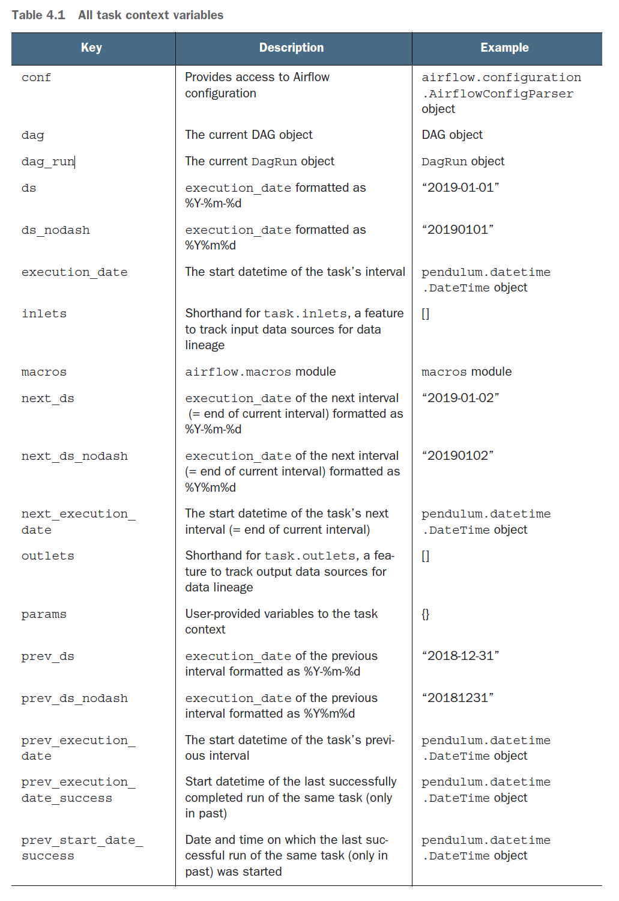
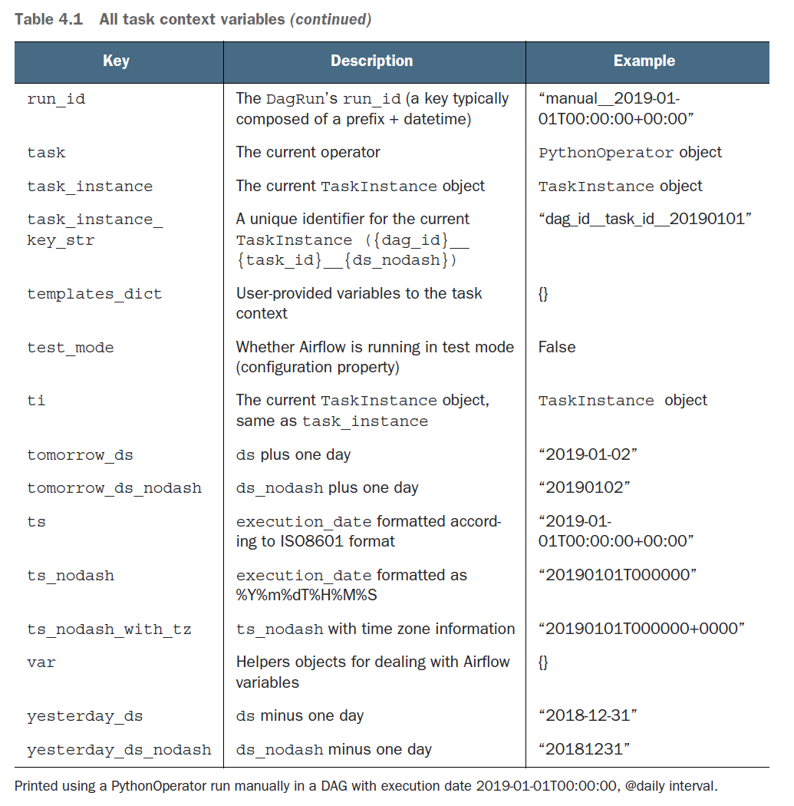

# What is available for templating?

## List
- conf : <airflow.configuration.AirflowConfigParser object at 0x7f8398c08cd0>

- dag : <DAG: check_task_context>

- dag_run : <DagRun check_task_context @ 2022-07-23 00:00:00+00:00: scheduled__2022-07-23T00:00:00+00:00, externally triggered: False>

- ds : 2022-07-23

- ds_nodash : 20220723

- execution_date : 2022-07-23T00:00:00+00:00

- inlets : []

- macros : <module 'airflow.macros' from '/home/airflow/.local/lib/python3.8/site-packages/airflow/macros/__init__.py'>

- next_ds : 2022-07-24

- next_ds_nodash : 20220724

- next_execution_date : 2022-07-24T00:00:00+00:00

- outlets : []

- params : {}

- prev_ds : 2022-07-22

- prev_ds_nodash : 20220722

- prev_execution_date : 2022-07-22T00:00:00+00:00

- prev_execution_date_success : None

- prev_start_date_success : None

- run_id : scheduled__2022-07-23T00:00:00+00:00

- task : <Task(PythonOperator): print_kwargs>

- task_instance : <TaskInstance: check_task_context.print_kwargs 2022-07-23T00:00:00+00:00 [running]>

- task_instance_key_str : check_task_context__print_kwargs__20220723

- test_mode : False

- ti : <TaskInstance: check_task_context.print_kwargs 2022-07-23T00:00:00+00:00 [running]>

- tomorrow_ds : 2022-07-24

- tomorrow_ds_nodash : 20220724

- ts : 2022-07-23T00:00:00+00:00

- ts_nodash : 20220723T000000

- ts_nodash_with_tz : 20220723T000000+0000

- var : {'json': None, 'value': None}

- yesterday_ds : 2022-07-22

- yesterday_ds_nodash : 20220722

- templates_dict : None
