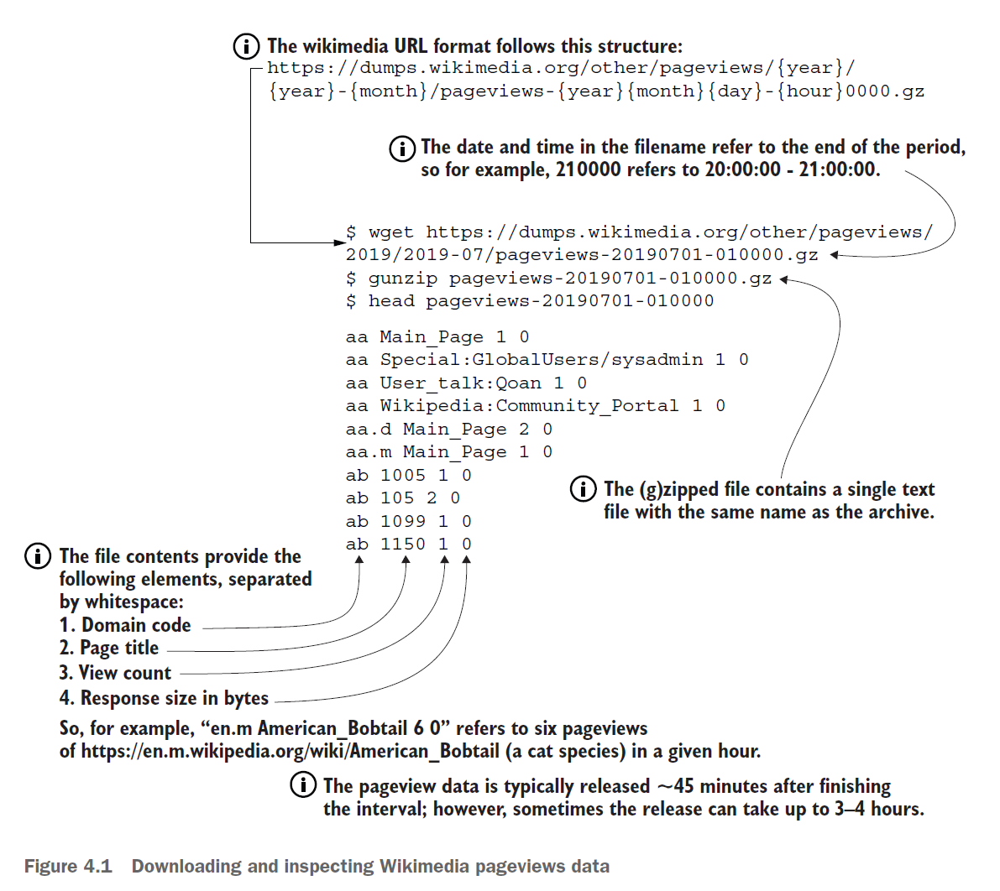
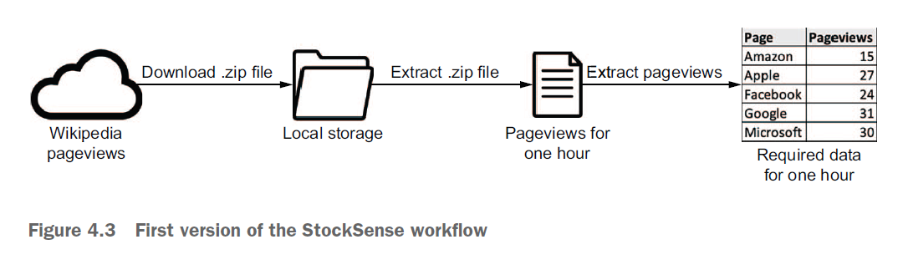

# Templating tasks using the Airflow context

## Operators

- what operators represent

- what operators are

- how they function

- how operators can be used to communicate with remote systems via hooks

### Example

- 위키피디아는 1시간마다 각 페이지의 pageview 데이터를 제공

- 우리는 주식 가격을 예측하기 위해 이 데이터를 사용하기로 함

- 활용을 위해 간단한 명제를 두고 접근

    - 특정 회사의 pageview가 증가한다 > 대중의 관심 증가로 주식 가격 상승

    - 반대로 감소한다 > 대중의 관심에서 멀어지므로 주식 가격 하락

- 위키피디아 pageview 데이터

    

- 대략적인 workflow

    

## [4.2 Task context and Jinja templting](./4.2_Task_context_and_Jinja_templating.md)